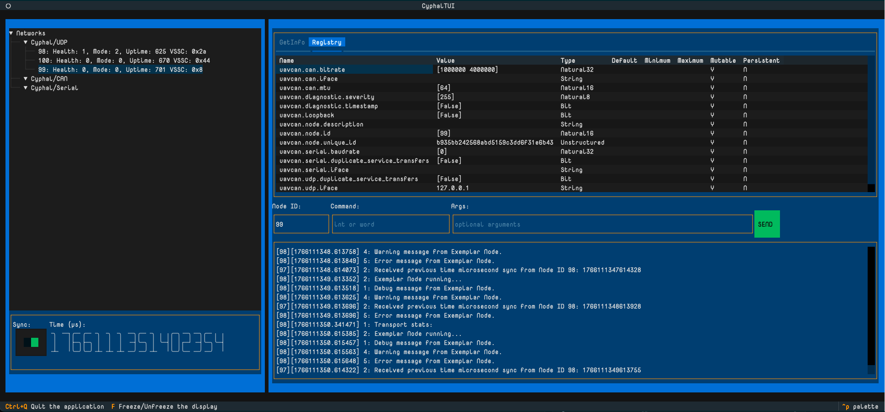

# Cyphal TUI

A `textual` based TUI for monitoring Cyphal networks.



## Features

Supports:

* uavcan.node.Heartbeat
* uavcan.node.GetInfo
* uavcan.node.port.List
* uavcan.diagnostic.Record
* uavcan.node.ExecuteCommand
* uavcan.time.Synchronization
* uavcan.node.GetTransportStatistics (UNTESTED)
* FileServer (uses `pycyphal` implementation)
  * uavcan.file.Read
  * uavcan.file.List
  * uavcan.file.Write
  * uavcan.file.GetInfo
  * uavcan.file.Modify

Future Support:

* uavcan.time.GetSynchronizationMasterInfo
* uavcan.register.List
* uavcan.register.Access

## Usage

### Environment

I setup a python virtual env with this:

```bash
python3 -m venv .venv
source .venv/bin/activate
# Required
pip install textual pycyphal
# Only use these to test, not needed for runtime
pip install yakut==0.13.0 textual-dev
# Install yactui from here as editable
pip install -e .
```

This is the contents of the .env I use. I've setup a `cyphal` folder in my home directory which has the [UAVCAN Data Types](https://github.com/OpenCyphal/public_regulated_data_types) in the `dsdl` folder and I've precompiled them to the `generated` folder.

```bash
export CYPHAL_PATH=$HOME/cyphal/dsdl
export PYCYPHAL_PATH=$HOME/cyphal/generated
# if you want to use Yakut
export YAKUT_PATH=$HOME/cyphal/generated
# If you have problems with the auto DSDL generation
export PYTHONPATH=$HOME/cyphal/generated
```

No need to set `UAVCAN__NODE__ID` or `UAVCAN__UDP__IFACE`.

#### Precompiling

```bash
# Using yakut <= 0.13.0
yakut -v compile -O ${YAKUT_PATH} ${CYPHAL_PATH}/uavcan ${CYPHAL_PATH}/reg
# After 0.13.0 it's automatic if you have CYPHAL_PATH and PYCYPHAL_PATH set.
```

### Command Options

```bash
$ yactui --help
Usage: yactui [-h] [-v] [--node-id NODE_ID] [--interface INTERFACE] [--ip IP] [--mtu MTU] [--cyphal-path CYPHAL_PATH] [--gen-path GEN_PATH]

Yet Another Cyphal Textual User Interface (YACTUI)

Options:
  -h, --help            show this help message and exit
  -v, --verbose         Increase verbosity level
  --node-id NODE_ID     The Node ID for this TUI instance in the Cyphal network default=0
  --interface INTERFACE
                        The network interface to bind to for Cyphal communication default=lo
  --ip IP               The IP address to bind to for Cyphal communication default=127.0.0.1
  --mtu MTU             The MTU to use for Cyphal communication default=1448
```

## Debugging

You can use `textual`'s console to capture some UI events and see some logging output, sometimes. No every crash can be captured this way.

```bash
# Assuming all the exported variables above as used!!
# Assuming use of
source .venv/bin/activate

# In this project folder, in a terminal window
textual console

# In another terminal window
textual run --dev src/yactui/cli.py --node-id 97

# In another terminal window
# The exemplar uses all the right message definitions to exercise the TUI
yactui --node-id 98 --exemplar
```

## TODO

* See [Issues](https://github.com/emrainey/yactui/issues)
